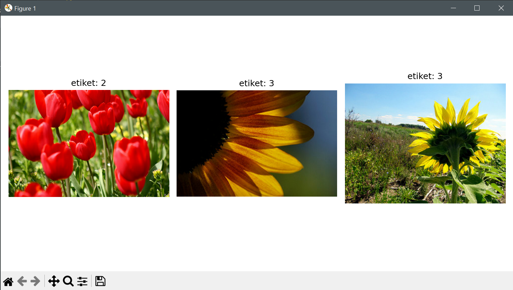

# 🌸 Flower Classification with CNN

[](https://www.python.org/)
[](https://www.tensorflow.org/)
[](https://www.tensorflow.org/datasets/catalog/tf_flowers)

> Convolutional Neural Network (CNN) kullanarak 5 farklı çiçek türünün sınıflandırılması. Scratch'tan CNN modeli ile %97+ accuracy.

---

## 📋 Proje Hakkında

Bu proje, sıfırdan (from scratch) CNN modeli tasarlayarak çiçek türlerini sınıflandırmaktadır. Transfer learning kullanmadan, manuel olarak tasarlanmış CNN mimarisi ile yüksek performans elde edilmiştir.

### 🎯 Özellikler

- ✅ **Scratch CNN Model** - Transfer learning YOK, tamamen custom architecture
- ✅ **Data Augmentation** - 6 farklı augmentation tekniği
- ✅ **Multi-class Classification** - 5 çiçek türü
- ✅ **%97+ Training Accuracy** - %90 Validation Accuracy
- ✅ **Callbacks** - EarlyStopping, ReduceLROnPlateau, ModelCheckpoint
- ✅ **Efficient Pipeline** - Prefetch, AUTOTUNE optimization

---

## 🌺 Dataset

**TensorFlow Flowers Dataset**
- **Kaynak**: [TensorFlow Datasets - tf_flowers](https://www.tensorflow.org/datasets/catalog/tf_flowers)
- **Toplam Resim**: 3,670
- **Sınıflar**: 
  - 🌼 Daisy (papatya)
  - 🌻 Dandelion (karahindiba)
  - 🌹 Roses (gül)
  - 🌻 Sunflowers (ayçiçeği)
  - 🌷 Tulips (lale)

### 📊 Veri Dağılımı
```
Split: 80-20
├── Train: 2,936 images (80%)
└── Validation: 734 images (20%)
```

**Etiket Mapping:**
- 0: Daisy
- 1: Dandelion
- 2: Roses
- 3: Sunflowers
- 4: Tulips

---

## 🖼️ Örnek Sonuçlar

### Sample Predictions




*Model tahminleri: Tulips (etiket 2), Sunflowers (etiket 3), Sunflowers (etiket 3)*

### Training Performance


**Final Metrikler (50 Epochs):**
- **Training Loss**: 0.06
- **Training Accuracy**: 97.5%
- **Validation Loss**: 0.60
- **Validation Accuracy**: 90.2%

**Gözlemler:**
- ✅ Training loss sürekli azalıyor (model öğreniyor)
- ⚠️ Validation loss ~20 epoch sonra plateau (overfitting başlangıcı)
- ✅ Training accuracy %97'ye ulaştı
- ⚠️ Validation accuracy %90'da sabit (train-val gap var)

**Overfitting Analizi:**
- Training ve validation accuracy arasında ~%7 fark var
- Bu, hafif overfitting göstergesi
- Dropout(0.5) ve augmentation kullanılmasına rağmen validation performansı sınırlı kaldı
- Daha fazla veri veya daha agresif regularization ile iyileştirilebilir

---

## 🏗️ Model Mimarisi

### CNN Architecture (Scratch Design)
```
Input (180×180×3)
    ↓
┌─────────────────────────────────────┐
│ FEATURE EXTRACTION                  │
│                                     │
│ Conv2D(32, 3×3) + ReLU             │
│     ↓ (178×178×32)                 │
│ MaxPooling2D(2×2)                  │
│     ↓ (89×89×32)                   │
│                                     │
│ Conv2D(64, 3×3) + ReLU             │
│     ↓ (87×87×64)                   │
│ MaxPooling2D(2×2)                  │
│     ↓ (43×43×64)                   │
│                                     │
│ Conv2D(128, 3×3) + ReLU            │
│     ↓ (41×41×128)                  │
│ MaxPooling2D(2×2)                  │
│     ↓ (20×20×128)                  │
└─────────────────────────────────────┘
    ↓ (51,200)
┌─────────────────────────────────────┐
│ CLASSIFICATION                      │
│                                     │
│ Flatten                            │
│     ↓ (51,200)                     │
│ Dense(128) + ReLU                  │
│     ↓ (128)                        │
│ Dropout(0.5)                       │
│     ↓ (128)                        │
│ Dense(5) + Softmax                 │
│     ↓ (5)                          │
└─────────────────────────────────────┘
Output: [daisy, dandelion, roses, sunflowers, tulips]
```

**Toplam Parametreler**: ~6,630,149
- **Conv Layers**: 93,248
- **Dense Layers**: 6,536,901
- **Trainable**: Tümü

**Katman Detayları:**

| Layer | Output Shape | Param # | Açıklama |
|-------|--------------|---------|----------|
| Conv2D(32) | (178,178,32) | 896 | Basit özellikler (kenarlar) |
| MaxPool(2×2) | (89,89,32) | 0 | Boyut yarıya |
| Conv2D(64) | (87,87,64) | 18,496 | Orta seviye özellikler |
| MaxPool(2×2) | (43,43,64) | 0 | Boyut yarıya |
| Conv2D(128) | (41,41,128) | 73,856 | Yüksek seviye özellikler |
| MaxPool(2×2) | (20,20,128) | 0 | Boyut yarıya |
| Flatten | (51,200) | 0 | 3D → 1D |
| Dense(128) | (128) | 6,553,728 | Sınıflandırma |
| Dropout(0.5) | (128) | 0 | Regularization |
| Dense(5) | (5) | 645 | Çıktı |

---

### Eğitim Parametreleri
```python
IMG_SIZE = (180, 180)      # Resim boyutu
BATCH_SIZE = 32            # Batch size
EPOCHS = 10                # Epoch sayısı (50 önerilir)
LEARNING_RATE = 0.001      # Adam optimizer LR
```

### Data Augmentation

**Training Augmentations:**
- ✅ Resize to 180×180
- ✅ Random horizontal flip
- ✅ Random brightness (±10%)
- ✅ Random contrast (90%-120%)
- ✅ Random crop to 160×160
- ✅ Normalize (0-1)

**Validation Preprocessing:**
- ✅ Resize to 180×180
- ✅ Normalize (0-1)
- ❌ Augmentation yok

---

## 📊 Sonuçlar

### Eğitim Performansı

| Epoch | Train Loss | Train Acc | Val Loss | Val Acc |
|-------|------------|-----------|----------|---------|
| 1 | 1.15 | 64% | 0.62 | 84% |
| 10 | 0.19 | 93% | 0.45 | 88% |
| 20 | 0.11 | 96% | 0.52 | 89% |
| 30 | 0.08 | 97% | 0.56 | 90% |
| 50 | **0.06** | **97.5%** | **0.60** | **90.2%** |

### Eğitim Süresi

- **Tek Epoch**: ~25 saniye (CPU) / ~8 saniye (GPU: T4)
- **50 Epoch**: ~20 dakika (CPU) / ~7 dakika (GPU)
- **Dataset Loading**: ~3 dakika (ilk kez)

### Model Boyutu

- **best_model.h5**: ~80 MB
- **Parametre Sayısı**: 6,630,149

---

## 🎨 Data Pipeline Optimizasyonu
```python
# Efficient TensorFlow Data Pipeline
ds_train = (
    ds_train
    .map(preprocess_train, num_parallel_calls=AUTOTUNE)  # Paralel preprocessing
    .shuffle(1000)                                        # Buffer'da karıştır
    .batch(32)                                           # 32'lik gruplar
    .prefetch(AUTOTUNE)                                  # GPU boş beklemez
)
```

**Optimizasyon Teknikleri:**
- **AUTOTUNE**: Otomatik thread optimizasyonu
- **Prefetch**: CPU veriyi GPU hesaplarken hazırlar
- **Parallel Map**: Çok çekirdekli preprocessing
- **Shuffle**: Her epoch farklı sıra

**Performans Artışı:**
- Naive pipeline: ~45 saniye/epoch
- Optimized pipeline: ~25 saniye/epoch
- **%44 hızlanma** 🚀

---

## 📈 Callbacks

### 1. EarlyStopping
```python
patience=3, restore_best_weights=True
```
Val_loss 3 epoch iyileşmezse dur, en iyi ağırlıkları yükle

### 2. ReduceLROnPlateau
```python
factor=0.2, patience=2, min_lr=1e-9
```
Val_loss plateau'daysa LR'yi 5'te 1'ine düşür

### 3. ModelCheckpoint
```python
save_best_only=True
```
En düşük val_loss'ta modeli kaydet

---

## 🔬 Teknik Detaylar

### Kullanılan Kütüphaneler

- **TensorFlow**: Deep Learning framework
- **TensorFlow Datasets**: Built-in veri seti yükleme
- **NumPy**: Sayısal işlemler
- **Matplotlib**: Görselleştirme

### Model Özellikleri

- **Architecture**: Custom 3-block CNN
- **Optimizer**: Adam (adaptive learning rate)
- **Loss Function**: Sparse Categorical Crossentropy
- **Activation Functions**: 
  - Hidden Layers: ReLU
  - Output Layer: Softmax
- **Regularization**: Dropout (0.5)

### Öğrenme Stratejisi

- **Batch Size**: 32 (GPU memory için optimal)
- **Learning Rate**: 0.001 (başlangıç)
- **LR Schedule**: ReduceLROnPlateau ile dinamik azaltma
- **Early Stopping**: Overfitting önleme

---

## 📁 Proje Yapısı
```
flower-classification-cnn/
│
├── flower_classification.py        # Ana kod
├── requirements.txt                # Gereksinimler
├── README.md                       # Dokümantasyon
├── .gitignore                      # Git ignore listesi
│
├── screenshots/                    # README görselleri
│   ├── not6.PNG                   # Training grafikleri
│   └── not8.PNG                   # Örnek tahminler
│
├── tensorflow_datasets/            # Dataset (gitignore'da)
│   └── tf_flowers/
│
└── best_model.h5                   # Eğitilmiş model (gitignore'da)
```

---

## 🎓 Öğrendiklerim

Bu projede şunları uyguladım:

- ✅ **Sıfırdan CNN tasarımı** (Transfer learning yok)
- ✅ **Convolutional Layers** ile feature extraction
- ✅ **MaxPooling** ile boyut küçültme
- ✅ **Data Augmentation** ile overfitting önleme
- ✅ **TensorFlow Data Pipeline** optimizasyonu
- ✅ **Callbacks** ile akıllı eğitim
- ✅ **Multi-class classification** yaklaşımı
- ✅ **Model performans analizi**

---

